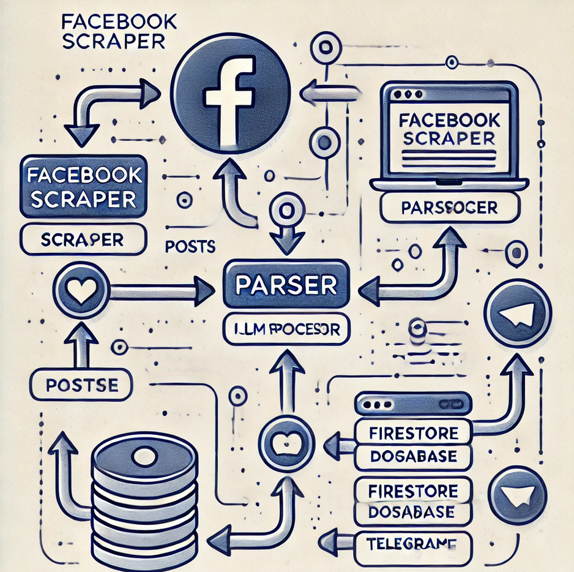

# AI-Apartments-Bot

# Project Overview

This application automates the process of scraping Facebook posts, summarizing them, storing them in Firestore, and delivering updates via a Telegram bot.

## Workflow

1. **Facebook Scraper**:
   - Scrapes posts from specified Facebook groups.
   - Extracts key details: `poster_id`, `post_id`, `content`, `timestamp`, and `image_url`.

2. **Parser**:
   - Parses raw post data into structured JSON.

3. **LLM Processor**:
   - Summarizes parsed data using ChatGPT.

4. **Firestore Database**:
   - Stores structured and summarized data.

5. **Telegram Bot**:
   - Fetches updates from Firestore and sends them to the user.

## Key Features

- Scrapes posts from Facebook groups in real-time.
- Uses AI to summarize unstructured post content.
- Delivers apartment details, images, and contact links via Telegram.

